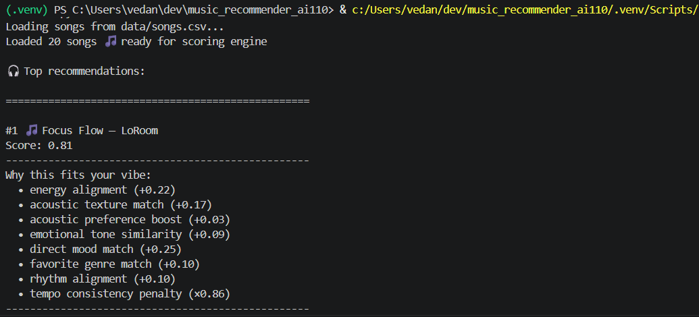

# 🎵 Music Recommender Simulation

## Project Summary

In this project you will build and explain a small music recommender system.

Your goal is to:

- Represent songs and a user "taste profile" as data
- Design a scoring rule that turns that data into recommendations
- Evaluate what your system gets right and wrong
- Reflect on how this mirrors real world AI recommenders

Replace this paragraph with your own summary of what your version does.

---

## How The System Works

Explain your design in plain language.
Real world recommendation systems evaluate many signals to decide which music fits a listener at a given moment, combining audio characteristics, user intent, listening context, and historical behavior, then continuously refining results through feedback and pattern recognition. My current version will focus on modeling the decision logic behind this process before introducing learning. For every song, the system will ask: “How well does this song match the listener’s current headspace?” The system will operate in two stages: first a scoring rule, where each song will be independently evaluated using weighted audio features such as energy, acousticness, mood alignment, genre similarity, and inferred rhythm preferences; and second a ranking rule, which will organize the highest scoring songs into a balanced recommendation list by resolving close scores, encouraging artist variety, and maintaining smooth tempo flow. Instead of filtering songs out, the design will prioritize overall vibe similarity and listening experience, reflecting how modern platforms favor flexible personalization and playlist coherence over rigid genre matching.

Some prompts to answer:

- What features does each `Song` use in your system
Each song uses these features:
genre
mood
energy
tempo (BPM)
valence (positivity)
danceability
acousticness
artist (for diversity handling)
-  `UserProfile` information
favorite genre
mood context (multiple moods such as focused, relaxed, late-night)
target energy range (instead of a single value)
target valence
target acousticness
preference for acoustic vs electronic sound
-`Recommender` Scoring approach

The  system: 
compares song attributes with user preferences
computes a weighted similarity score based on vibe features (energy range matching, acousticness, valence)
adds contributions for mood matches (direct or mood-family based)
adds genre similarity as a soft contextual boost
infers rhythm preference from energy range to evaluate danceability alignment
applies penalties for repeated artists and large tempo mismatches to maintain diversity and flow
- Recommendation selection

The system:
scores every song in the dataset independently
sorts songs from highest to lowest final score
applies ranking rules to improve variety and listening coherence
returns the top k songs as final recommendations

This system may introduce a soft preference bias toward the user’s initial mood and energy range, meaning it can over-reinforce similar “headspace” songs (e.g., always returning similar lofi/focused tracks). It may also under-represent highly contrasting but potentially enjoyable music (like high-energy or emotionally different genres), since exploration is not explicitly modeled beyond soft genre adjacency and penalties.
---

## Getting Started

### Setup

1. Create a virtual environment (optional but recommended):

   ```bash
   python -m venv .venv
   source .venv/bin/activate      # Mac or Linux
   .venv\Scripts\activate         # Windows

2. Install dependencies

```bash
pip install -r requirements.txt
```

3. Run the app:

```bash
python -m src.main
```

### Running Tests

Run the starter tests with:

```bash
pytest
```

You can add more tests in `tests/test_recommender.py`.

---

## Experiments You Tried

Use this section to document the experiments you ran. For example:

- What happened when you changed the weight on genre from 2.0 to 0.5
- What happened when you added tempo or valence to the score
- How did your system behave for different types of users

---

## Limitations and Risks

Summarize some limitations of your recommender.

Examples:

- It only works on a tiny catalog
- It does not understand lyrics or language
- It might over favor one genre or mood

You will go deeper on this in your model card.

---

## Reflection

Read and complete `model_card.md`:

[**Model Card**](model_card.md)

Write 1 to 2 paragraphs here about what you learned:

- about how recommenders turn data into predictions
- about where bias or unfairness could show up in systems like this


---

## 7. `model_card_template.md`

Combines reflection and model card framing from the Module 3 guidance. :contentReference[oaicite:2]{index=2}  

```markdown
# 🎧 Model Card - Music Recommender Simulation

## 1. Model Name

Give your recommender a name, for example:

> VibeFinder 1.0

---

## 2. Intended Use

- What is this system trying to do
- Who is it for

Example:

> This model suggests 3 to 5 songs from a small catalog based on a user's preferred genre, mood, and energy level. It is for classroom exploration only, not for real users.

---

## 3. How It Works (Short Explanation)

Describe your scoring logic in plain language.

- What features of each song does it consider
- What information about the user does it use
- How does it turn those into a number

Try to avoid code in this section, treat it like an explanation to a non programmer.

---

## 4. Data

Describe your dataset.

- How many songs are in `data/songs.csv`
- Did you add or remove any songs
- What kinds of genres or moods are represented
- Whose taste does this data mostly reflect

---

## 5. Strengths

Where does your recommender work well

You can think about:
- Situations where the top results "felt right"
- Particular user profiles it served well
- Simplicity or transparency benefits

---

## 6. Limitations and Bias

Where does your recommender struggle

Some prompts:
- Does it ignore some genres or moods
- Does it treat all users as if they have the same taste shape
- Is it biased toward high energy or one genre by default
- How could this be unfair if used in a real product

---

## 7. Evaluation

How did you check your system

Examples:
- You tried multiple user profiles and wrote down whether the results matched your expectations
- You compared your simulation to what a real app like Spotify or YouTube tends to recommend
- You wrote tests for your scoring logic

You do not need a numeric metric, but if you used one, explain what it measures.

---

## 8. Future Work

If you had more time, how would you improve this recommender

Examples:

- Add support for multiple users and "group vibe" recommendations
- Balance diversity of songs instead of always picking the closest match
- Use more features, like tempo ranges or lyric themes

---

## 9. Personal Reflection

A few sentences about what you learned:

- What surprised you about how your system behaved
- How did building this change how you think about real music recommenders
- Where do you think human judgment still matters, even if the model seems "smart"

