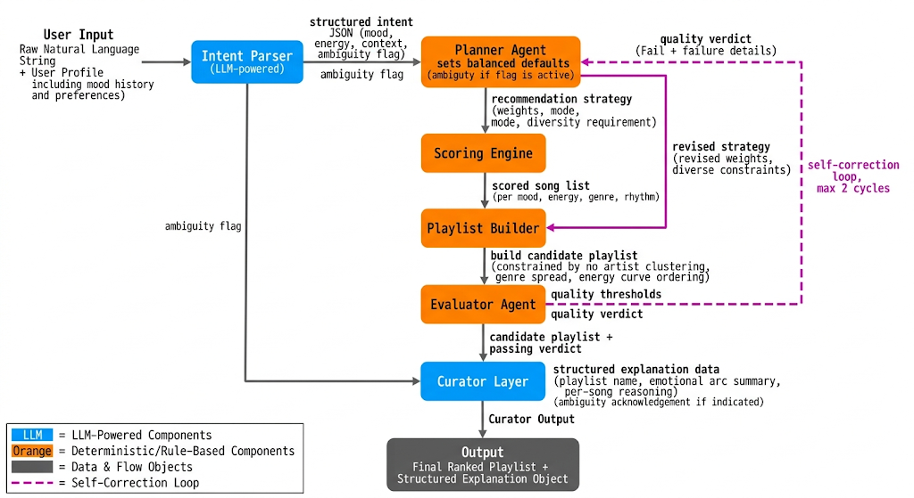

# 🎵 Music Recommender Simulation

## Project Summary

This project is a simulation of a music recommendation system that models how modern recommender engines make decisions using structured reasoning instead of machine learning.

The system takes a natural language input from the user (for example, “chill lofi music for studying”) and converts it into structured preferences such as mood, energy range, genre signals, and acoustic preferences. These signals are then used to generate recommendations through a multi-stage pipeline.

---

## How The System Works

Explain your design in plain language.
Real world recommendation systems evaluate many signals to decide which music fits a listener at a given moment, combining audio characteristics, user intent, listening context, and historical behavior, then continuously refining results through feedback and pattern recognition. 

The focus of the project is interpretability and system design, showing how recommendation engines can be built as understandable pipelines rather than opaque models, while still producing meaningful, personalized results.

The system works in three stages:

First, the **intent parser** converts natural language input (like “chill lofi for studying”) into structured user preferences such as energy range, mood context, valence, and genre signals.

Second, the **planner agent** chooses a recommendation strategy based on the clarity and strength of the user intent. It decides whether to prioritize focused matching, balanced exploration, or high-energy discovery.

Third, the **recommender and playlist builder** score individual songs using weighted audio features like energy, mood alignment, genre similarity, and acoustic preference. The highest scoring songs are then assembled into a playlist with optional constraints such as artist diversity and smooth energy flow.

Finally, the **curator agent** generates a human-readable explanation of the playlist, including a name, emotional arc, and per-song reasoning for why each track fits the recommendation.


- What features does each `Song` use in your system
Each song uses these features:
genre
mood
energy
tempo (BPM)
valence (positivity)
danceability
acousticness
artist (for diversity handling)
-  `UserProfile` information
favorite genre
mood context (list of moods like ["chill", "focused"])
target energy range (low, high)
target valence
target acousticness
likes_acoustic (boolean preference signal)

-`Recommender` Scoring approach

The system follows a structured, multi-stage recommendation pipeline:

Each song is independently scored using a rule-based function that compares its features (energy, mood, genre, valence, acousticness, etc.) against the structured user intent.
Songs are then sorted by their final score from highest to lowest.
The playlist builder selects the top k songs while enforcing constraints such as artist diversity and optional energy-flow shaping (to create a smooth listening experience).
The final output is a coherent playlist sequence, not just a ranked list, designed to reflect both matching quality and listening flow.

This system introduces a controlled bias toward the user’s inferred intent (especially mood and energy), since the scoring function strongly prioritizes alignment with these signals. However, exploration is still partially supported through:

planner-based strategy variation (focused vs balanced vs exploration modes)
diversity constraints in artist selection
soft structural variation in playlist ordering (energy curve shaping)

As a result, the system tends to favor highly relevant “vibe-consistent” recommendations, while still allowing limited variation through planning and diversity rules.

## Architecture Design:


This architecture follows a modular hybrid pipeline that separates understanding, decision-making, and execution. An intent layer interprets raw user input and converts it into structured preferences, which are then passed to a Planner Agent that defines the recommendation strategy, including weighting signals, diversity constraints, and energy behavior. This keeps the system flexible at the top while maintaining controlled, predictable behavior downstream.

The lower layers are deterministic. A scoring engine ranks songs using fixed rules over audio and preference features, and a playlist builder assembles the final list while enforcing constraints like artist diversity and optional energy flow ordering. An evaluator layer checks output quality and can trigger refinement if needed, while the curator layer generates human-readable explanations, including playlist naming, emotional arc, and per-song reasoning to make the results interpretable.

## Getting Started

### Setup

1. Create a virtual environment (optional but recommended):

   ```bash
   python -m venv .venv
   source .venv/bin/activate      # Mac or Linux
   .venv\Scripts\activate         # Windows

2. Install dependencies

```bash
pip install -r requirements.txt
```

3. Run the app:

```bash
python -m src.main
```

### Running Tests

Run the starter tests with:

```bash
pytest
```

---

## Sample Interactions:
```
Type a mood (or 'exit' to quit)

👉 Enter request: chill lofi study music
Tracklist:

  01. Spacewalk Thoughts — Orbit Bloom
      Role : intro
      Why  : ambient supports mood chill with energy 0.28

  02. Midnight Coding — LoRoom
      Role : transition
      Why  : lofi supports mood chill with energy 0.42

  03. Late Bus Home — Sora Avenue
      Role : transition
      Why  : indie electronic supports mood late-night with energy 0.55

  04. Library Rain — Paper Lanterns
      Role : transition
      Why  : lofi supports mood chill with energy 0.35

  05. Static Hearts — Cloud Theory
      Role : transition
      Why  : bedroom pop supports mood nostalgic with energy 0.42

  06. Softly — Karan Aujla
      Role : transition
      Why  : punjabi supports mood chill with energy 0.58

Example 2: 
🎧 AGENTIC MUSIC RECOMMENDER
Type a mood (or 'exit' to quit)

👉 Enter request: something chill and relaxed for studying

======================================================================
🎧 AGENTIC MUSIC CURATION SYSTEM
======================================================================
Loading songs from data/songs.csv...
Loaded 90 songs 🎵 ready for scoring engine

🧠 Intent Parsed
  target_energy_range: (0.1, 0.4)
  target_valence: 0.5
  target_acousticness: 0.5
  mood_context: ['chill', 'relaxed', 'focused']
  favorite_genre: pop
  likes_acoustic: False

📋 Plan: mode=focused | confidence=0.95
   reason: high confidence intent; prioritize direct matching

🔁 Iteration 1 — scoring with adjusted prefs
   Score: 0.89 | Pass: True
✅ Evaluation passed

======================================================================
🎼 FINAL PLAYLIST
======================================================================

📀 Chill Hip Hop Mix
Tracklist:

  01. Spacewalk Thoughts — Orbit Bloom
      Role : intro
      Why  : ambient supports mood chill with energy 0.28

  02. Midnight Coding — LoRoom
      Role : transition
      Why  : lofi supports mood chill with energy 0.42

  03. Softly — Karan Aujla
      Role : transition
      Why  : punjabi supports mood chill with energy 0.58

  04. Library Rain — Paper Lanterns
      Role : transition
      Why  : lofi supports mood chill with energy 0.35

  05. Rose Rouge — St. Germain
      Role : transition
      Why  : jazz supports mood chill with energy 0.48

```

## Design Decisions

This system was built as a modular pipeline instead of one large model. I separated intent parsing, planning, scoring, and playlist building so each part has a clear responsibility. The goal was to make the system easier to debug and improve step by step.

A rule-based approach was used for scoring instead of a trained model because it is more transparent and easier to control for a project of this scale. The trade-off is that it may not capture complex music preferences as well as a learning-based recommender.

## Testing Summary

Most unit tests passed after refining the intent parser, planner logic, and recommender scoring. The system works well for clear inputs like “chill lofi study music” or “high energy gym songs.”

Some weaker cases still appear when user input is vague or emotionally mixed, where mood detection and genre inference are less accurate. Confidence scoring helped identify these uncertain cases and improve decision-making in the planner.

## Experiments You Tried

When I reduced the genre weight from 2.0 to 0.5, recommendations became less repetitive and more diverse. Genre stopped dominating the results, and mood and energy had a stronger influence, making the system feel more balanced.

Adding tempo and valence made recommendations feel more accurate in terms of emotion and rhythm. However, I noticed that strong weights can still group songs into similar “energy clusters,” which reduces variety.

For different user types, the system works well when preferences are clear, but struggles with conflicting inputs. In those cases, it tends to average signals instead of properly resolving contradictions.

---

## Limitations and Risks

- Small dataset limits diversity and realism  
- Can still over-favor certain genres or moods  
- Assumes user preferences stay consistent  

---

## Reflection

This project helped me understand how real recommendation systems are built as pipelines instead of a single AI model. I learned how important structured data, intermediate representations (like intent and plans), and feedback loops are for improving output quality.

It also showed me that building AI systems is less about having a perfect model and more about designing good decision flows, handling uncertainty, and iterating through testing and evaluation.